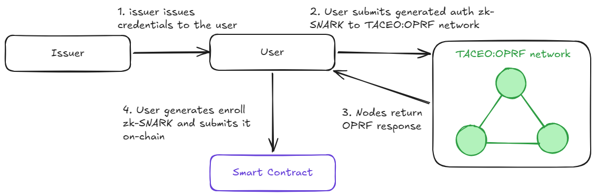

# Proof of Uniqueness

Privacy-preserving identity verification based on zkSNARKs using:

- Verifiable credentials
- Noir zk circuits
- threshold OPRF nodes for enrollment

This is a research prototype for testing the proposed design. It is not production ready code.

## How it works

The local app issues a demo verifiable credential (VC) with BabyJubJub issuer and holder keys. In the browser, the holder first proves that the VC authorizes a blinded OPRF request. The local OPRF nodes verify that proof, return threshold OPRF responses, and the browser verifies the live transcript.

The browser then builds a second Noir proof for enrollment. That proof ties together the VC, the holder key, the connected wallet address, and the verified OPRF transcript. `IdentityRegistry` verifies the final proof on-chain, stores the resulting nullifier, and uses EIP-712 wallet signatures for enrollment authorization and revocation.



## Repo layout

```text
src/
├── circuits/          Noir circuits used by the client and OPRF auth module
├── client/            React app
├── oprf-testnet/      Local OPRF node stack and auth module
└── smart-contracts/   Foundry project with IdentityRegistry
```

## Component responsibilities

- `src/client`: builds demo VCs, generates browser proofs, talks to OPRF nodes, and submits registry transactions.
- `src/circuits`: contains the active Noir circuits for VC-backed OPRF authentication and on-chain enrollment.
- `src/oprf-testnet`: runs the local TACEO:OPRF node stack and the VC ownership auth module.
- `src/smart-contracts`: verifies enrollment proofs and stores minimal identity state in `IdentityRegistry`.

Circuit artifacts must stay in sync across these pieces. If a circuit changes, rebuild the circuit JSON, Rust verification key, generated Solidity verifier, and client `public/` assets together.

## Prerequisites

You need the usual local tooling for this repo:

- `git`
- `cargo`
- `docker`
- `foundry` (`forge`, `anvil`)
- `node` + `npm`
- `nargo` / `bb` (only if you want to rebuild circuit artifacts)

## Setup

### Quick setup with Make

First initialize the submodules:

This repo depends on nested code inside submodules, including vendored Noir dependencies used by the circuits.

```bash
git submodule update --init --recursive
```

Then use the root Makefile:

Start the TACEO:OPRF testnet:

```bash
make oprf-testnet
```

This also starts a local Anvil chain.

In another terminal, deploy the smart contract using the live OPRF public key:

```bash
make deploy
```

Then start the web client:

```bash
make web
```

Open [http://localhost:5173](http://localhost:5173).

In the local client, issuer registration is sent with the default Anvil owner private key. The connected MetaMask wallet is still used for enrollment and revocation.

### Manual setup

#### 1. Init submodules

```bash
git submodule update --init --recursive
```

#### 2. Start the local OPRF stack

The client expects three local OPRF nodes at:

- `http://127.0.0.1:10000`
- `http://127.0.0.1:10001`
- `http://127.0.0.1:10002`

Bring them up with:

```bash
cd src/oprf-testnet
chmod +x local-setup.sh
./local-setup.sh setup
```

What this script does:

- builds the OPRF workspace
- starts Docker services for the OPRF databases and keygen nodes
- starts three local OPRF nodes
- initializes OPRF keys so `/oprf_pub/*` is available on the nodes

Keep this terminal running.

This script also starts a local Anvil chain. If you only need the blockchain network without the OPRF stack, run Anvil manually:

```bash
anvil --code-size-limit 50000
```

#### 3. Deploy the smart contract

Recommended local deployment uses the live OPRF public key from the running node:

```bash
cd src/smart-contracts
PRIVATE_KEY=0xac0974bec39a17e36ba4a6b4d238ff944bacb478cbed5efcae784d7bf4f2ff80 \
./script/deploy-identity-registry-dynamic-oprf.sh
```

After deployment, update the client contract address in:

- [src/client/src/lib/wagmi.ts](./src/client/src/lib/wagmi.ts)

If you redeploy `IdentityRegistry`, the client must point to the new address.

#### 4. Run the client

In another terminal:

```bash
cd src/client
npm install
npm run dev
```
